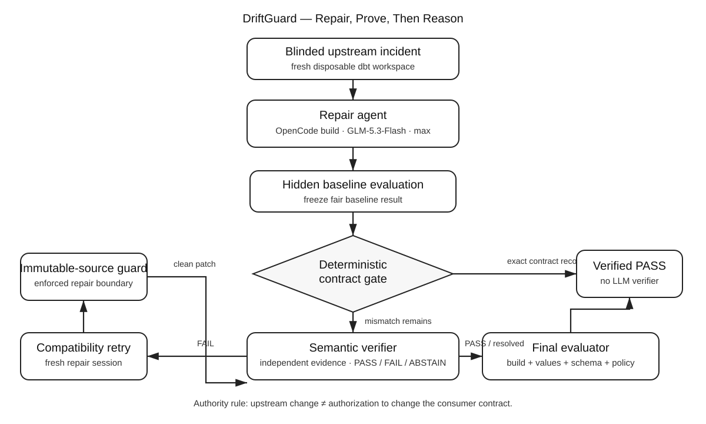

# DriftGuard

**Independent contract verification for AI-generated dbt repairs.**

> DriftGuard catches the dangerous case where an AI repaired your data pipeline, every test is green, and the data is still wrong.

## Why this exists

**Intended user:** analytics engineering and data-platform teams that allow AI coding agents to investigate or repair dbt projects, but still need a defensible approval gate before accepting a patch.

The bottleneck has shifted. Modern coding agents can often repair obvious SQL failures. The harder question is whether a patch that *builds* still preserves the data contract that downstream consumers rely on.

A repair can pass normal tests while silently changing:

- business values;
- units or category meaning;
- column types and interfaces;
- key relationships;
- customer/order attribution.

That makes a green pipeline necessary, but not sufficient, evidence of recovery.

## Result

On a frozen 12-case benchmark built from the public synthetic dbt Jaffle Shop project:

| System | Verified Recovery Rate | Change vs baseline |
|---|---:|---:|
| General-purpose coding-agent baseline | **6/12 (50.0%)** | — |
| DriftGuard Iteration 1 | **7/12 (58.3%)** | +8.3 pp |
| **DriftGuard Iteration 2** | **11/12 (91.7%)** | **+41.7 pp** |

Iteration 2 rescued **5 of 6 baseline failures**, introduced **0 regressions**, and achieved **100% verifier FAIL precision and 100% FAIL recall** on the frozen suite. Six of the twelve cases were certified by a deterministic contract gate, so only the unresolved half required an LLM semantic-verifier call.

The official headline remains **91.7%**, even though the one remaining failure was later traced to an orchestration interruption and successfully re-run after infrastructure hardening. We do not retroactively inflate the frozen benchmark result.

See [`docs/EVALUATION.md`](docs/EVALUATION.md) and [`CHANGELOG.md`](CHANGELOG.md).

## Architecture



The final workflow deliberately separates what can be **proven** from what requires **interpretation**:

1. **Repair agent** — investigates the changed dbt project and proposes the smallest compatibility-preserving patch.
2. **Deterministic contract gate** — checks build status, values, schema/row-count contract, and protected-source integrity. Proven-correct repairs stop here.
3. **Independent semantic verifier** — receives machine-generated contract evidence, not the repair agent's reasoning, and returns PASS / FAIL / ABSTAIN.
4. **Compatibility retry** — a fresh repair session acts on verifier feedback.
5. **Immutable-source guard** — enforces that upstream source snapshots are not rewritten to make the repair appear successful.
6. **Hidden final evaluator** — computes Verified Recovery Rate against the frozen golden contract.

The most important design principle is an **authority boundary**: an upstream source changing tells us what the source sends; it does not by itself authorize changing the downstream consumer contract.

## Primary metric: Verified Recovery Rate (VRR)

An incident counts as recovered only when all required checks pass:

- `dbt build` succeeds;
- logical values match the known-good contract;
- logical schema/interface matches the known-good contract;
- row counts/relationships remain valid;
- protected source snapshots are not rewritten;
- tests/schema are not weakened to manufacture success.

`VRR = verified recoveries / total incidents`

This is intentionally stricter than build success.

## Benchmark

The scored suite contains 12 deterministic, blinded incidents:

- **3 structural** — obvious renamed keys/columns that break execution;
- **3 representation/contract** — the project can build while interface/value representation changes;
- **6 silent-semantic** — the project can build while business meaning changes.

Before agent runs, `preflight_suite.sh` proves that every injected incident exhibits its declared control behavior. Two earlier candidate mutations were removed because DuckDB canonicalized them into no observable contract change; they were not allowed into the scored benchmark.

The cases are frozen in [`benchmark/cases/index.txt`](benchmark/cases/index.txt).

## Fair baseline

The baseline uses the same OpenCode setup and the same incident workspaces as the final workflow:

- OpenCode `1.18.25` in the recorded runs;
- OpenCode Go `opencode-go/glm-5.3-flash`;
- `max` variant / effort;
- OpenCode `build` agent;
- repository + terminal + dbt access;
- a simple repair prompt in [`prompts/baseline.md`](prompts/baseline.md).

The baseline does **not** receive the golden snapshot, hidden evaluator output, or benchmark case metadata before it finishes its repair.

## Quick start

Prerequisites:

- Linux/macOS shell environment;
- `git`;
- [`uv`](https://docs.astral.sh/uv/);
- OpenCode with access to an appropriate model (the recorded experiment used OpenCode Go GLM-5.3-Flash).

Then:

```bash
./scripts/bootstrap.sh
./scripts/capture_golden.sh
./scripts/preflight_suite.sh
./scripts/run_opencode_suite.sh
```

The suite writes submission evidence under:

```text
evidence/runs/<case>/<run_id>/
evidence/summary/
evidence/suites/
```

For exact clean-environment instructions, baseline-only commands, expected output, versions, runtime, and cost notes, read [`REPRODUCTION.md`](REPRODUCTION.md).

## One-case demo

```bash
./scripts/run_opencode_flow.sh payment_unit_drift
```

`payment_unit_drift` is the clearest demonstration of the problem: the upstream payment source switches from cents to dollars while the staging model still divides by 100. The project can remain **28/28 green** while payment-derived outputs are wrong. A baseline repair can restore values while accidentally changing downstream numeric types; DriftGuard's contract verification catches the remaining interface regression.

## OpenCode trajectories

Every automated stage stores:

- raw JSONL events;
- session export when available;
- final agent response;
- verifier evidence and verdict;
- candidate/final patches;
- baseline and final evaluator JSON;
- `flow_summary.json`;
- OpenCode Web session links.

Representative, judge-friendly trajectories are summarized in [`evidence/representative-trajectories/`](evidence/representative-trajectories/). The prompts that shape every agent role are committed under [`prompts/`](prompts/).

## Repository map

```text
benchmark/                 incident injection, snapshotting, gates, evaluation
benchmark/cases/           frozen 12-case benchmark
prompts/                   baseline, verifier, repair/retry instructions
scripts/                   setup, preflight, OpenCode orchestration, reporting
tests/                     benchmark/orchestration tests
docs/                      architecture, evaluation, video, judge checklist
evidence/submission/       frozen headline summaries for the submission
evidence/representative-trajectories/
                           concise representative agent trajectories
```

`vendor/jaffle_shop_duckdb` is fetched during bootstrap and is not committed.

## Safety and scope

- All consequential changes happen inside disposable benchmark workspaces.
- Upstream seed snapshots are treated as immutable external facts during repair.
- DriftGuard is an approval/verification workflow, not an autonomous production deployer.
- The benchmark uses public synthetic Jaffle Shop data; no private user data or credentials are required.

## Improvement story

The architecture was not designed upfront and then justified afterward. The failure trajectories drove the changes:

- baseline solved obvious drift but missed contract failures;
- Iteration 1 added independent verification and exposed **authority confusion** plus unsafe repair boundaries;
- Iteration 2 moved provable checks into deterministic gates, defined contract authority explicitly, and enforced immutable upstream sources;
- post-hoc hardening added workspace-local scratch paths and detects agent processes that exit successfully without completing the intended repair.

Read the full evidence-linked history in [`CHANGELOG.md`](CHANGELOG.md).

## Main failure mode and hot take

The most dangerous failure is not an agent that crashes. It is an agent that produces a plausible patch, passes the visible test suite, and silently changes business semantics or an interface contract.

> **Reliable agents need authority boundaries, not just more reasoning. Use deterministic checks for what can be proven, agents for what requires interpretation, and enforcement for constraints the agent must not violate.**

## Submission docs

- [`CHANGELOG.md`](CHANGELOG.md) — final Improvement Changelog
- [`REPRODUCTION.md`](REPRODUCTION.md) — clean-environment reproduction guide
- [`docs/EVALUATION.md`](docs/EVALUATION.md) — evaluation tables and evidence map
- [`docs/architecture.md`](docs/architecture.md) — architecture explanation + Mermaid source
- [`docs/VIDEO_SCRIPT.md`](docs/VIDEO_SCRIPT.md) — ≤5-minute script/storyboard
- [`docs/JUDGE_CHECKLIST.md`](docs/JUDGE_CHECKLIST.md) — rubric audit against all 100 points
- [`PERSONAL_REPO_GUIDE.md`](PERSONAL_REPO_GUIDE.md) — private commit-history setup guide; do not submit if you do not want it public
