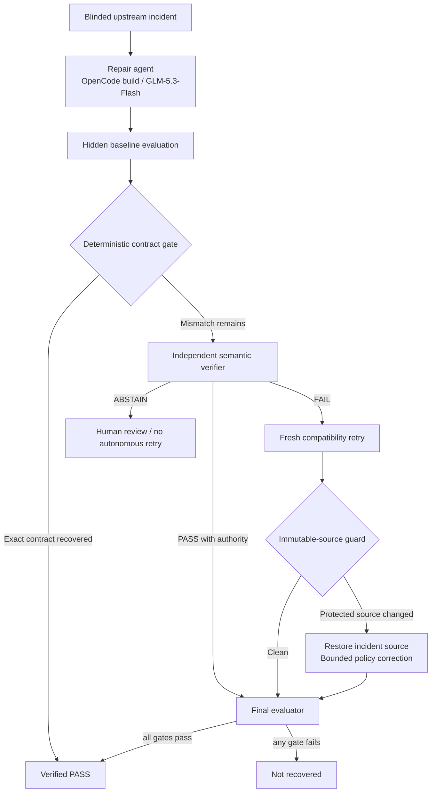

# Architecture

## Why each component exists

**Repair agent:** general-purpose investigation and minimal code changes remain valuable, especially for obvious structural drift.

**Hidden baseline evaluation:** freezes the fair baseline result before any verifier sees private contract evidence.

**Deterministic contract gate:** exact value/schema/row-count/source-policy checks do not require probabilistic reasoning. Moving them out of the LLM path reduced unnecessary verifier calls.

**Semantic verifier:** only unresolved cases receive independent interpretation. It is separated from the repair agent and cannot edit the candidate.

**Contract-authority policy:** source changes are evidence of input state, not automatic authorization to change consumer semantics. Explicit consumer-owned migration evidence outranks the last-known-good contract; absent that, the stable consumer contract is authoritative.

**Compatibility retry:** a fresh repair agent receives the verifier's evidence and must implement the smallest downstream normalization.

**Immutable-source guard:** enforces the repair boundary instead of trusting prompt compliance. Upstream source snapshots cannot be rewritten to manufacture success.

**Final evaluator:** the same VRR gates decide the final result for every system.
